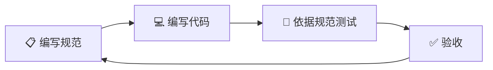

# 00 — 项目总览 | 艺育皮韵 · 非遗数字教育平台

> **方法论**：SDD（Specification-Driven Development，规范驱动开发）
> **原则**：先写规范 → 再写代码 → 规范即文档即测试依据

---

## 一、项目定位

**艺育皮韵**是一个以非物质文化遗产皮雕技艺为核心的线上教育平台，通过"传统技艺 + 数字科技"模式，打造集**教学、创作、展示、交流**于一体的综合性平台。

平台提供**课程学习、作品展示、材料采购、广西特色皮雕购买、社区互动**等全链条服务，满足用户从入门到精通的多元化需求，实现皮雕技艺的**活态传承**与**创造性转化**。

---

## 二、核心理念

| 理念 | 说明 |
|------|------|
| 🎯 **活态传承** | 非遗技艺不做静态展示，而是"可学、可练、可创、可售"的活态生态 |
| 🌐 **数字赋能** | AI 辅助教学、3D 作品展示、虚拟工具模拟，降低入门门槛 |
| 🏔 **广西特色** | 深度融合壮族、瑶族等民族纹样元素，打造地域文化品牌 |
| 🔗 **全链服务** | 从"学技艺→选材料→做作品→展成果→售文创"一站式闭环 |
| 🤝 **社区驱动** | 学员互助、师徒结对、创作挑战、直播互动构建活跃社区 |

---

## 三、目标用户

| 用户角色 | 画像 | 核心需求 |
|----------|------|----------|
| **学习者（新手）** | 对皮雕感兴趣的零基础爱好者 | 系统课程、工具认识、入门练习 |
| **学习者（进阶）** | 有一定基础想提升的手工爱好者 | 高级技法、创意设计、作品指导 |
| **传承人/教师** | 非遗传承人、手工艺教师 | 开设课程、传播技艺、获取收入 |
| **创作者** | 独立皮雕手工艺人/设计师 | 作品展示、销售渠道、品牌塑造 |
| **消费者** | 喜爱手工艺品的文创消费者 | 购买皮雕成品、定制礼品 |
| **材料商** | 皮革/工具供应商 | 入驻商城、面向精准用户销售 |
| **研学机构** | 学校、文旅机构 | 团体课程、研学路线、合作对接 |

---

## 四、核心功能模块

### 4.1 教学系统（Learn）

| 功能 | 说明 |
|------|------|
| 阶梯式课程 | 入门 → 进阶 → 精通，视频+图文混合 |
| 分步骤教学 | 选皮 → 画稿 → 镂刻 → 印花 → 染色 |
| AI 学习助手 | 智能问答、知识点推荐、学习路径规划 |
| 作业系统 | 学员提交作品照片/视频，教师点评 |
| 学习进度 | 课程完成度、证书颁发、积分体系 |
| 直播课堂 | 名家直播授课，实时互动 |

### 4.2 创作工具（Create）

| 功能 | 说明 |
|------|------|
| 纹样素材库 | 壮锦、瑶族图腾、喀斯特地貌等广西特色纹样 |
| AI 纹样生成 | 输入关键词/风格 → AI 生成皮雕纹样参考 |
| 设计灵感墙 | 优秀作品 + 传统纹样 + 现代设计融合案例 |
| 工具百科 | 各类刻刀、印花模具、皮料的图鉴与使用指南 |

### 4.3 展示平台（Show）

| 功能 | 说明 |
|------|------|
| 作品画廊 | 瀑布流展示，支持高清大图、多角度查看 |
| 3D 作品展 | 作品 3D 模型展示（Three.js） |
| 传承人档案 | 非遗传承人口述史、从艺经历、代表作 |
| 虚拟展馆 | 线上沉浸式展览（VR 全景） |
| 创作故事 | 每件作品背后的创作故事与文化内涵 |

### 4.4 商城系统（Shop）

| 功能 | 说明 |
|------|------|
| 皮雕成品 | 广西特色皮雕作品、文创衍生品 |
| 材料工具 | 皮料、刻刀、染料、模具等 |
| 定制服务 | 用户提需求 → 匠人定制 |
| 课程包 | 课程 + 材料包 + 工具套装 |
| 商家入驻 | 材料商/工匠独立店铺管理 |
| 订单管理 | 下单 → 支付 → 发货 → 评价全流程 |

### 4.5 社区互动（Community）

| 功能 | 说明 |
|------|------|
| 话题广场 | 技艺讨论、经验分享、素材交流 |
| 创作挑战 | "每日一雕"打卡、主题创作赛 |
| 师徒结对 | 传承人与学徒的结对机制 |
| 动态发布 | 图文/短视频动态、点赞评论 |
| 问答专区 | 技术问题互助答疑 |
| 非遗地图 | 广西非遗体验基地 + 研学路线 |

### 4.6 管理后台（Admin）

| 功能 | 说明 |
|------|------|
| 用户管理 | 角色分配、封禁、审核 |
| 内容审核 | 课程/作品/评论审核 |
| 数据仪表盘 | 用户活跃度、课程完课率、销售数据 |
| 运营工具 | Banner 管理、推送通知、活动配置 |
| 财务管理 | 订单流水、商家结算、分润配置 |
| 系统配置 | AI 模型管理、邮件配置、支付配置 |

---

## 五、技术栈选型

### 5.1 核心技术栈

| 层级 | 技术 | 版本 | 说明 |
|------|------|------|------|
| **前端** | Next.js | 15+ | App Router, RSC, SSR/SSG |
| **后端** | NestJS | 11+ | 模块化、DI、装饰器模式 |
| **数据库** | PostgreSQL | 16+ | 主数据库，JSONB 支持 |
| **ORM** | Prisma | 6+ | 类型安全、迁移管理 |
| **缓存** | Redis | 7+ | 会话、缓存、队列 |
| **对象存储** | MinIO / 阿里云 OSS | — | 图片、视频、文件存储 |
| **搜索引擎** | Meilisearch | 1.x | 全文搜索、课程/商品搜索 |

### 5.2 工程化工具

| 工具 | 说明 |
|------|------|
| **架构** | 前后端分离，独立仓库/独立部署 |
| **语言** | TypeScript 5.x（全栈统一） |
| **代码规范** | ESLint + Prettier + Oxlint |
| **Git 规范** | Conventional Commits + Husky + lint-staged |
| **API 文档** | Swagger / OpenAPI 3.1（NestJS 内置） |
| **测试** | Jest + Supertest（后端）、Playwright（E2E） |
| **CI/CD** | GitHub Actions |

### 5.3 扩展技术

| 技术 | 场景 |
|------|------|
| **Three.js / React Three Fiber** | 3D 作品展示 |
| **Socket.IO** | 直播互动、实时通知 |
| **Bull / BullMQ** | 任务队列（视频转码、AI 异步任务） |
| **OpenAI 兼容协议** | AI 纹样生成、智能问答 |
| **Sharp** | 图片处理（压缩、裁切、水印） |
| **FFmpeg** | 视频处理（转码、切片） |
| **Zod** | 运行时类型校验（前后端共享） |

### 5.4 部署方案

| 组件 | 方案 |
|------|------|
| 前端 | Vercel / Nginx + Docker |
| 后端 | Docker Compose / K8s |
| 数据库 | 云数据库 / Docker PostgreSQL |
| 对象存储 | MinIO（开发）/ 阿里云 OSS（生产） |
| CDN | 阿里云 CDN / Cloudflare |
| 监控 | Prometheus + Grafana |
| 日志 | Winston + ELK Stack |

---

## 六、项目结构（前后端分离）

```
leather-carving/
├── frontend/                   # Next.js 15 前端（独立部署）
│   ├── src/
│   │   ├── app/                # App Router 页面
│   │   ├── components/         # React 组件
│   │   │   ├── ui/             # 基础 UI 组件
│   │   │   ├── layout/         # 布局组件
│   │   │   ├── business/       # 业务组件
│   │   │   └── forms/          # 表单组件
│   │   ├── hooks/              # 自定义 Hooks
│   │   ├── stores/             # Zustand 状态管理
│   │   ├── styles/             # 全局样式 + Design Tokens
│   │   ├── lib/                # 工具函数 + API Client
│   │   ├── contexts/           # React Context
│   │   ├── types/              # 前端专用类型
│   │   └── shared/             # 从 shared/ 同步的共享代码
│   ├── public/                 # 静态资源
│   ├── package.json            # 前端独立依赖
│   ├── next.config.ts
│   ├── tsconfig.json
│   └── .env.local
│
├── backend/                    # NestJS 11 后端（独立部署）
│   ├── src/
│   │   ├── modules/            # 功能模块（按领域划分）
│   │   │   ├── auth/           # 认证模块
│   │   │   ├── user/           # 用户模块
│   │   │   ├── course/         # 课程模块
│   │   │   ├── artwork/        # 作品模块
│   │   │   ├── shop/           # 商城模块
│   │   │   ├── community/      # 社区模块
│   │   │   ├── ai/             # AI 服务模块
│   │   │   ├── storage/        # 存储模块
│   │   │   ├── notification/   # 通知模块
│   │   │   └── admin/          # 管理后台模块
│   │   ├── common/             # 公共模块（Guards, Filters, Pipes）
│   │   ├── config/             # 配置模块
│   │   ├── shared/             # 从 shared/ 同步的共享代码
│   │   └── main.ts
│   ├── prisma/
│   │   └── schema.prisma
│   ├── package.json            # 后端独立依赖
│   ├── tsconfig.json
│   ├── nest-cli.json
│   └── .env
│
├── shared/                     # 前后端共享代码（构建时同步到各项目）
│   ├── types/                  # 共享 TypeScript 类型定义
│   │   ├── user.ts
│   │   ├── course.ts
│   │   ├── product.ts
│   │   ├── community.ts
│   │   ├── api.ts              # 通用 API 响应类型
│   │   └── index.ts
│   ├── validators/             # Zod Schema（前后端共享验证）
│   └── utils/                  # 共享纯工具函数
│
├── docs/                       # SDD 开发文档
│   ├── 00_PROJECT_OVERVIEW.md
│   ├── ...
│   └── wave_prompts/
│
├── infra/                      # 基础设施配置
│   ├── docker-compose.dev.yml  # 开发环境（PG + Redis + MinIO）
│   ├── docker-compose.prod.yml # 生产环境
│   └── nginx/                  # Nginx 配置
│
├── scripts/                    # 项目脚本
│   └── sync-shared.sh          # 同步 shared/ 到前后端
│
├── .env.example                # 环境变量模板
├── AGENTS.md                   # AI 辅助开发规范
└── README.md
```

---

## 七、开发方法论

### SDD（Specification-Driven Development）流程



1. **先写规范**：数据模型、API 接口、组件规格全部提前定义
2. **再写代码**：严格遵循规范实现
3. **规范即测试**：验收标准直接来源于规范
4. **规范即文档**：规范文档本身就是最好的开发文档

### Wave 开发模式

项目采用 **Wave（浪潮式）** 分期开发，每个 Wave 独立可交付：

| Wave | 主题 | 核心交付 |
|------|------|----------|
| Wave 1 | 基础架构 | 前后端项目骨架 + 认证 + 设计系统 |
| Wave 2 | 教学核心 | 课程系统 + 视频播放 + 学习进度 |
| Wave 3 | 创作与展示 | 作品管理 + 3D 展示 + 纹样素材库 |
| Wave 4 | 商城系统 | 商品 CRUD + 购物车 + 订单 + 支付 |
| Wave 5 | 社区与 AI | 社区互动 + AI 助手 + 智能推荐 |
| Wave 6 | 管理后台 | 数据仪表盘 + 内容审核 + 系统配置 |
| Wave 7 | 打磨与部署 | 性能优化 + E2E 测试 + 生产部署 |

---

## 八、命名约定

| 维度 | 规则 | 示例 |
|------|------|------|
| 文件命名 | kebab-case | `course-card.tsx`, `auth.module.ts` |
| 组件命名 | PascalCase | `CourseCard`, `ArtworkGallery` |
| 变量/函数 | camelCase | `getCourseById`, `isAuthenticated` |
| 常量 | UPPER_SNAKE_CASE | `MAX_FILE_SIZE`, `API_BASE_URL` |
| 数据库表 | snake_case（复数） | `courses`, `order_items` |
| API 路由 | kebab-case | `/api/v1/courses`, `/api/v1/artwork-categories` |
| 环境变量 | UPPER_SNAKE_CASE | `DATABASE_URL`, `JWT_SECRET` |
| CSS 变量 | kebab-case + 前缀 | `--lc-primary`, `--lc-spacing-md` |
| Git 分支 | `type/description` | `feat/course-module`, `fix/auth-guard` |

---

## 九、文档索引

| # | 文件 | 内容 |
|---|------|------|
| 00 | `00_PROJECT_OVERVIEW.md` | 项目总览（本文档） |
| 01 | `01_TECH_ARCHITECTURE.md` | 技术架构设计 |
| 02 | `02_DATA_MODELS.md` | 数据模型（Prisma Schema + TypeScript） |
| 03 | `03_API_SPECIFICATION.md` | API 接口规格 |
| 04 | `04_UI_DESIGN_SYSTEM.md` | UI/UX 设计系统 |
| 05 | `05_AUTH_DESIGN.md` | 认证与授权设计 |
| 06 | `06_AI_SERVICE_DESIGN.md` | AI 服务架构设计 |
| 07 | `07_PAGE_ROUTES.md` | 页面路由与导航 |
| 08 | `08_COMPONENT_SPEC.md` | 组件规格定义 |
| 09 | `09_STATE_MANAGEMENT.md` | 状态管理设计 |
| 10 | `10_REALTIME_DESIGN.md` | 实时通信设计 |
| 11 | `11_STORAGE_DESIGN.md` | 存储与文件管理 |
| 12 | `12_TESTING_STRATEGY.md` | 测试策略与验收标准 |
| 13 | `13_DEPLOYMENT_GUIDE.md` | 部署与运维指南 |
| 14 | `14_SECURITY_NOTES.md` | 安全注意事项 |
| 15 | `15_CODING_STANDARDS.md` | 编码规范与 Git 规范 |
| 16 | `16_WAVE_ROADMAP.md` | Wave 开发路线图 |
| W1-W7 | `wave_prompts/wave{N}_prompt.md` | 各 Wave 开发提示词 |
| — | `AGENTS.md` | AI 辅助开发规范 |
