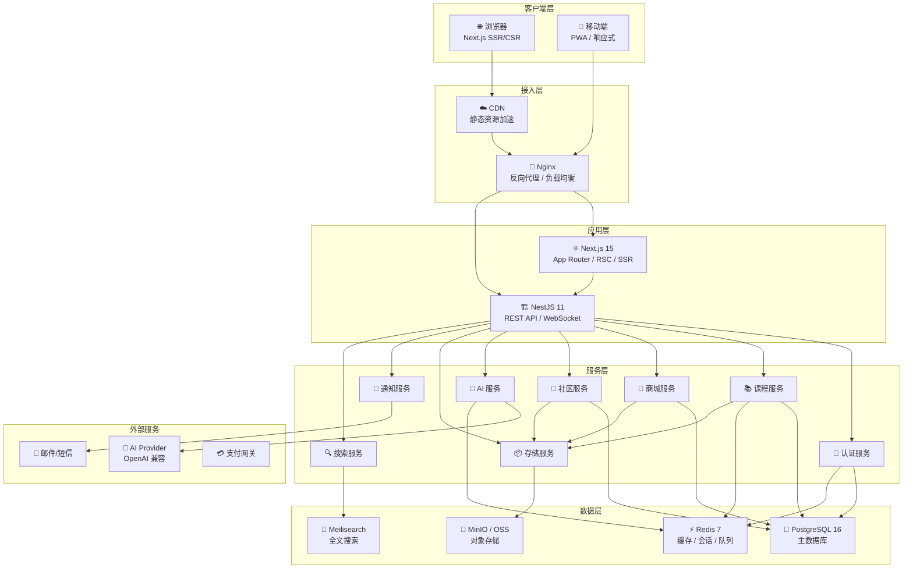
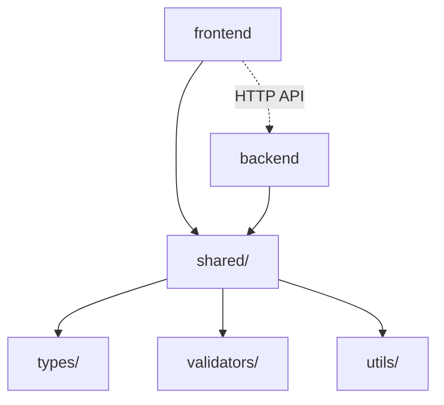
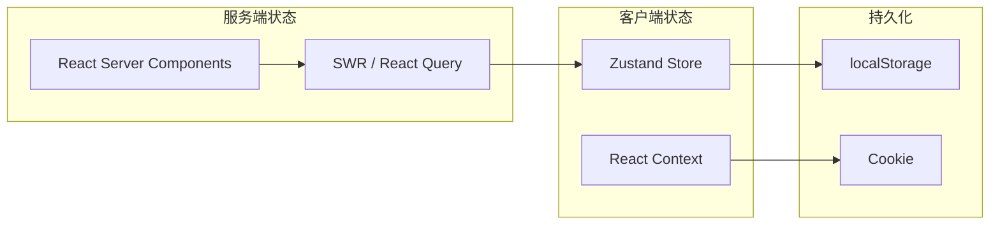
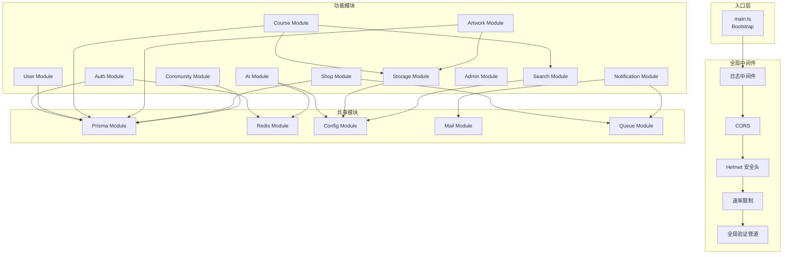
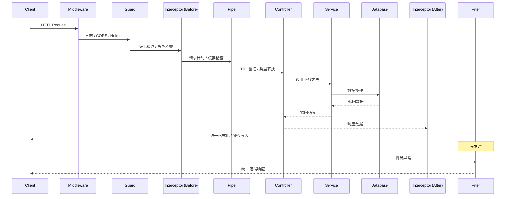
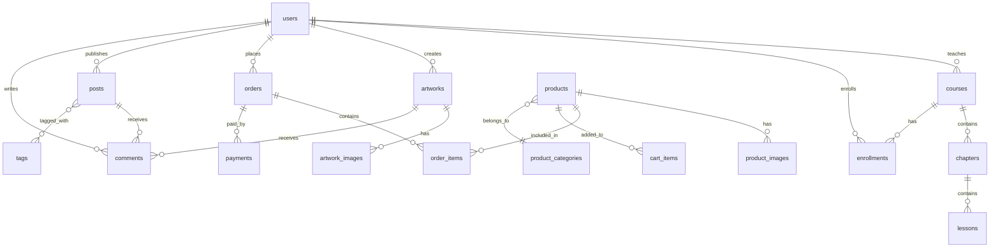
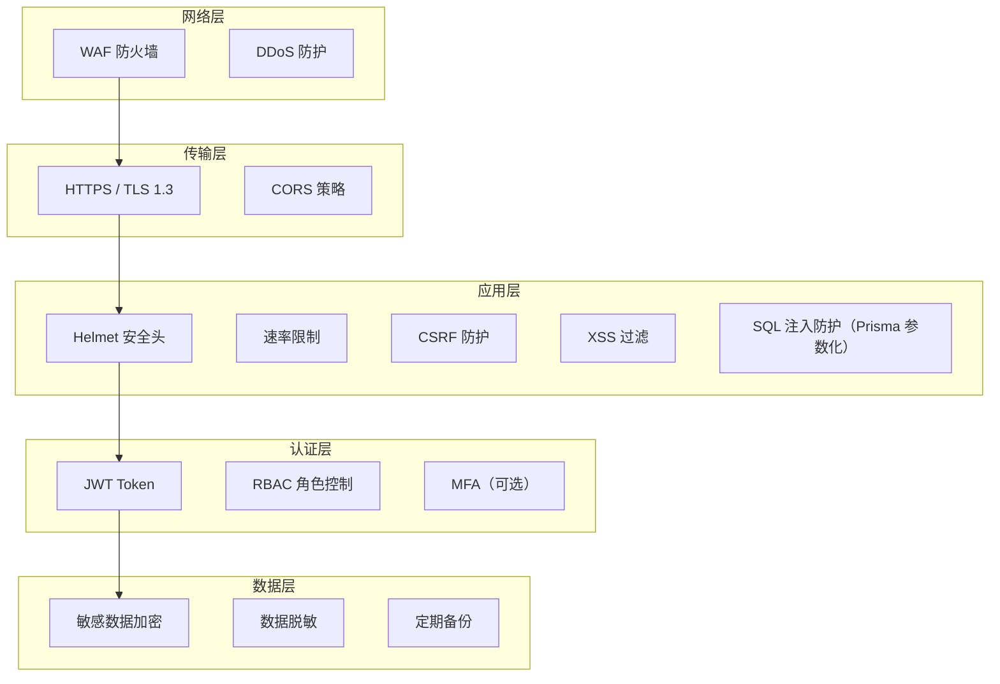

# 01 — 技术架构设计 | 艺育皮韵

> 本文档定义系统整体技术架构，包括前后端分离结构、分层设计、数据流、中间件策略及基础设施。

---

## 一、系统架构全景



---

## 二、前后端分离架构

### 2.1 项目划分

前端（`frontend/`）和后端（`backend/`）为独立项目，各自有独立的 `package.json`、构建配置和部署流程。通过 `shared/` 目录共享类型定义和工具函数。

```
leather-carving/
├── frontend/          # Next.js 15 前端（独立 package.json，独立部署）
├── backend/           # NestJS 11 后端（独立 package.json，独立部署）
├── shared/            # 共享代码（构建时复制到前后端）
│   ├── types/         # 共享 TypeScript 类型
│   ├── validators/    # Zod Schema
│   └── utils/         # 纯工具函数
├── infra/             # Docker / Nginx 配置
├── scripts/           # 构建脚本（如 sync-shared.sh）
└── docs/              # SDD 规范文档
```

### 2.2 共享代码同步策略

`shared/` 目录中的类型和工具函数通过脚本复制到前后端项目：

```bash
#!/bin/bash
# scripts/sync-shared.sh
cp -r shared/types frontend/src/shared/types
cp -r shared/validators frontend/src/shared/validators
cp -r shared/utils frontend/src/shared/utils
cp -r shared/types backend/src/shared/types
cp -r shared/validators backend/src/shared/validators
cp -r shared/utils backend/src/shared/utils
echo "✅ shared 代码已同步到 frontend 和 backend"
```

前后端项目可在 `package.json` 中配置 `predev` / `prebuild` 钩子自动执行同步。

### 2.3 依赖关系



---

## 三、前端架构（Next.js 15）

### 3.1 渲染策略

| 页面类型 | 渲染方式 | 说明 |
|----------|----------|------|
| 首页 / 课程列表 | SSG + ISR | 静态生成 + 增量更新（60s） |
| 课程详情 | SSR | 需要最新数据 + SEO |
| 商品详情 | SSR | 同上 |
| 学习播放页 | CSR | 交互密集，客户端渲染 |
| 个人中心 | CSR | 私有数据，客户端渲染 |
| 社区动态 | SSR + CSR 混合 | 列表 SSR，交互 CSR |
| 管理后台 | CSR | 纯后台功能 |

### 3.2 路由结构

```
src/app/
├── (public)/                   # 公开路由组
│   ├── page.tsx                # 首页
│   ├── courses/
│   │   ├── page.tsx            # 课程列表
│   │   └── [slug]/page.tsx     # 课程详情
│   ├── gallery/
│   │   ├── page.tsx            # 作品画廊
│   │   └── [id]/page.tsx       # 作品详情
│   ├── shop/
│   │   ├── page.tsx            # 商城首页
│   │   ├── [id]/page.tsx       # 商品详情
│   │   └── categories/page.tsx # 分类页
│   ├── community/
│   │   ├── page.tsx            # 社区首页
│   │   └── [topicId]/page.tsx  # 话题详情
│   └── heritage-map/page.tsx   # 非遗地图
│
├── (auth)/                     # 认证路由组
│   ├── login/page.tsx
│   ├── register/page.tsx
│   └── forgot-password/page.tsx
│
├── (dashboard)/                # 受保护路由组（需登录）
│   ├── layout.tsx              # Dashboard Layout
│   ├── learn/
│   │   └── [courseId]/
│   │       └── [lessonId]/page.tsx  # 学习播放页
│   ├── my-courses/page.tsx     # 我的课程
│   ├── my-artworks/page.tsx    # 我的作品
│   ├── my-orders/page.tsx      # 我的订单
│   ├── cart/page.tsx           # 购物车
│   ├── checkout/page.tsx       # 结算页
│   ├── profile/page.tsx        # 个人中心
│   ├── settings/page.tsx       # 设置
│   └── create/                 # 创作工具
│       ├── artwork/page.tsx    # 发布作品
│       └── pattern/page.tsx    # 纹样设计
│
├── (teacher)/                  # 教师路由组
│   ├── layout.tsx
│   ├── dashboard/page.tsx      # 教师面板
│   ├── courses/
│   │   ├── page.tsx            # 课程管理
│   │   └── [id]/edit/page.tsx  # 编辑课程
│   └── students/page.tsx       # 学员管理
│
├── (admin)/                    # 管理后台路由组
│   ├── layout.tsx
│   ├── dashboard/page.tsx      # 数据仪表盘
│   ├── users/page.tsx          # 用户管理
│   ├── content/page.tsx        # 内容审核
│   ├── shop/page.tsx           # 商城管理
│   ├── finance/page.tsx        # 财务管理
│   ├── system/page.tsx         # 系统配置
│   └── ai-config/page.tsx      # AI 配置管理
│
├── api/                        # Next.js API Routes（BFF 层）
│   └── [...proxy]/route.ts     # 代理到 NestJS
│
├── layout.tsx                  # 根 Layout
├── globals.css                 # 全局样式
├── loading.tsx                 # 全局 Loading
├── error.tsx                   # 全局错误
└── not-found.tsx               # 404
```

### 3.3 状态管理



| 状态类型 | 方案 | 场景 |
|----------|------|------|
| 服务端数据 | SWR / React Query | API 数据获取、缓存、重验证 |
| 全局 UI 状态 | Zustand | 主题、侧边栏、Modal |
| 用户会话 | React Context + Cookie | 登录态、用户信息 |
| 表单状态 | React Hook Form + Zod | 复杂表单 |
| 购物车 | Zustand + localStorage | 购物车数据 |

---

## 四、后端架构（NestJS 11）

### 4.1 模块架构



### 4.2 模块内部结构（以 Course 模块为例）

```
src/modules/course/
├── course.module.ts            # 模块定义
├── course.controller.ts        # 路由控制器
├── course.service.ts           # 业务逻辑
├── course.repository.ts        # 数据访问层（可选，Prisma 直接用也可）
├── dto/
│   ├── create-course.dto.ts    # 创建课程 DTO
│   ├── update-course.dto.ts    # 更新课程 DTO
│   └── query-course.dto.ts     # 查询参数 DTO
├── entities/
│   └── course.entity.ts        # 实体定义（映射 Prisma Model）
├── guards/
│   └── course-owner.guard.ts   # 课程所有权守卫
├── interceptors/
│   └── course-cache.interceptor.ts  # 缓存拦截器
└── __tests__/
    ├── course.controller.spec.ts
    └── course.service.spec.ts
```

### 4.3 NestJS 请求处理流程



### 4.4 统一响应格式

```typescript
// 成功响应
interface ApiResponse<T> {
  code: number;       // 业务状态码（200, 201 等）
  message: string;    // 人类可读消息
  data: T;            // 业务数据
  timestamp: string;  // ISO 8601
  requestId: string;  // 请求追踪 ID
}

// 分页响应
interface PaginatedResponse<T> extends ApiResponse<T[]> {
  pagination: {
    page: number;
    pageSize: number;
    total: number;
    totalPages: number;
  };
}

// 错误响应
interface ErrorResponse {
  code: number;
  message: string;
  error: string;      // 错误类型
  details?: any;      // 详细错误信息（开发环境）
  timestamp: string;
  requestId: string;
  path: string;
}
```

---

## 五、数据库架构

### 5.1 PostgreSQL 设计原则

| 原则 | 说明 |
|------|------|
| **软删除** | 所有核心表使用 `deleted_at` 字段，不物理删除 |
| **审计字段** | 所有表包含 `created_at`, `updated_at`, `created_by` |
| **UUID 主键** | 使用 UUID v7（时序排序）作为主键 |
| **JSONB** | 灵活字段使用 JSONB 存储（如课程元数据、商品属性） |
| **索引策略** | 高频查询字段建索引，JSONB 字段使用 GIN 索引 |
| **分区** | 订单、日志等大表按时间分区 |

### 5.2 核心表关系



---

## 六、缓存策略（Redis）

| 场景 | Key Pattern | TTL | 策略 |
|------|-------------|-----|------|
| 用户会话 | `session:{userId}` | 24h | 登出时删除 |
| 刷新令牌 | `refresh:{tokenId}` | 7d | 使用后轮换 |
| 课程详情缓存 | `course:{id}` | 10min | 编辑时失效 |
| 商品列表缓存 | `products:{queryHash}` | 5min | 商品变更时失效 |
| AI 对话上下文 | `ai:chat:{sessionId}` | 30min | 滑动窗口 |
| 速率限制 | `ratelimit:{ip}:{endpoint}` | 1min | 滑动窗口计数 |
| 验证码 | `verify:{email}:{code}` | 5min | 验证后删除 |
| 点赞计数 | `likes:{entityType}:{entityId}` | 永久 | 定期回写 DB |

---

## 七、安全架构

### 7.1 防护层次



### 7.2 速率限制规则

| 端点类型 | 限制 | 窗口 |
|----------|------|------|
| 登录/注册 | 5 次 | 1 分钟 |
| API 通用 | 100 次 | 1 分钟 |
| 文件上传 | 10 次 | 1 分钟 |
| AI 调用 | 20 次 | 1 分钟 |
| 管理员 API | 200 次 | 1 分钟 |

---

## 八、日志与监控

### 8.1 日志体系

| 层级 | 工具 | 说明 |
|------|------|------|
| 应用日志 | Winston | 结构化 JSON 日志 |
| 请求日志 | Morgan + 自定义中间件 | 请求/响应记录 |
| 错误追踪 | Sentry（可选） | 异常捕获与告警 |
| 审计日志 | 自定义 | 关键操作记录（谁、何时、做了什么） |

### 8.2 监控指标

| 指标 | 工具 | 说明 |
|------|------|------|
| API 响应时间 | Prometheus | P50 / P95 / P99 |
| 错误率 | Prometheus | 5xx / 4xx 比率 |
| 数据库连接池 | Prisma Metrics | 活跃/空闲连接数 |
| Redis 命中率 | Redis INFO | 缓存效率 |
| 资源使用 | Grafana | CPU / 内存 / 磁盘 |

---

## 九、API 版本化策略

- API 路径前缀：`/api/v1/`
- 当出现破坏性变更时，创建 `/api/v2/`
- 旧版本保留至少 6 个月的兼容期
- 使用 `X-API-Version` Header 作为备选版本选择机制

---

## 十、开发环境要求

| 工具 | 最低版本 | 说明 |
|------|----------|------|
| Node.js | 20 LTS | 运行时 |
| npm / pnpm | 9+ | 包管理器（前后端各自独立） |
| Docker | 24+ | 容器化 |
| Docker Compose | 2.20+ | 编排 |
| Git | 2.40+ | 版本控制 |
| PostgreSQL | 16+ | 数据库 |
| Redis | 7+ | 缓存 |
| VS Code | Latest | 推荐 IDE |
