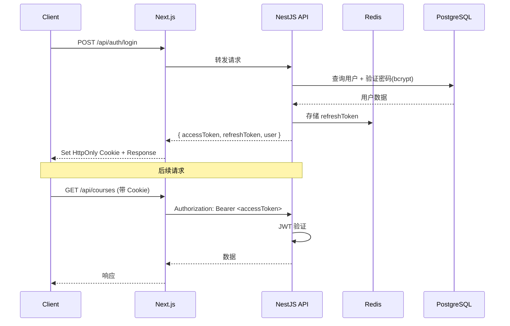
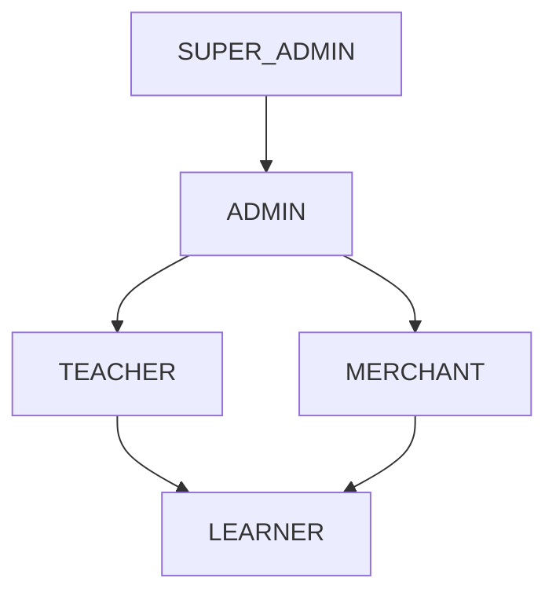

# 05 — 认证与授权设计 | 艺育皮韵

> JWT + RBAC 认证授权方案。NestJS Guards + Next.js Middleware 双层保护。

---

## 一、认证流程



---

## 二、Token 设计

| Token | 存储位置 | 有效期 | 用途 |
|-------|----------|--------|------|
| Access Token | HttpOnly Cookie + Memory | 2 小时 | API 请求认证 |
| Refresh Token | HttpOnly Cookie + Redis | 7 天 | 刷新 Access Token |

### JWT Payload

```typescript
interface JwtPayload {
  sub: string;        // userId
  email: string;
  role: UserRole;
  iat: number;        // 签发时间
  exp: number;        // 过期时间
  jti: string;        // Token ID（用于黑名单）
}
```

### Token 刷新策略

- Access Token 过期前 5 分钟，前端自动刷新
- Refresh Token 采用**轮换策略**：每次使用后签发新的 Refresh Token，旧的立即失效
- 登出时将 Refresh Token 从 Redis 删除

---

## 三、RBAC 角色权限



### 权限矩阵

| 资源 | LEARNER | TEACHER | MERCHANT | ADMIN |
|------|---------|---------|----------|-------|
| 浏览课程/商品 | ✅ | ✅ | ✅ | ✅ |
| 报名课程 | ✅ | ✅ | ✅ | ✅ |
| 购买商品 | ✅ | ✅ | ✅ | ✅ |
| 发布作品 | ✅ | ✅ | ✅ | ✅ |
| 社区发帖 | ✅ | ✅ | ✅ | ✅ |
| 创建课程 | ❌ | ✅ | ❌ | ✅ |
| 管理商品 | ❌ | ❌ | ✅ | ✅ |
| 内容审核 | ❌ | ❌ | ❌ | ✅ |
| 用户管理 | ❌ | ❌ | ❌ | ✅ |
| 系统配置 | ❌ | ❌ | ❌ | ✅(SUPER) |

### NestJS Guard 实现

```typescript
// 使用自定义装饰器
@Roles(UserRole.TEACHER, UserRole.ADMIN)
@UseGuards(JwtAuthGuard, RolesGuard)
@Post('courses')
createCourse(@Body() dto: CreateCourseDto) {}

// 资源所有权守卫
@UseGuards(JwtAuthGuard, OwnerGuard)
@Patch('courses/:id')
updateCourse(@Param('id') id: string) {}
```

---

## 四、Next.js Middleware

```typescript
// middleware.ts — 路由保护
const protectedRoutes = ['/dashboard', '/learn', '/my-*', '/cart', '/checkout'];
const teacherRoutes = ['/teacher'];
const adminRoutes = ['/admin'];
const authRoutes = ['/login', '/register'];

export function middleware(request: NextRequest) {
  const token = request.cookies.get('accessToken');
  const isProtected = protectedRoutes.some(r => pathname.startsWith(r));
  const isAuth = authRoutes.some(r => pathname.startsWith(r));

  if (isProtected && !token) return redirect('/login');
  if (isAuth && token) return redirect('/');
  // 角色路由检查...
}
```

---

## 五、密码安全

| 策略 | 说明 |
|------|------|
| 哈希算法 | bcrypt（cost factor = 12） |
| 最小长度 | 8 位 |
| 强度要求 | 至少包含大小写字母 + 数字 |
| 登录锁定 | 5 次失败后锁定 15 分钟 |
