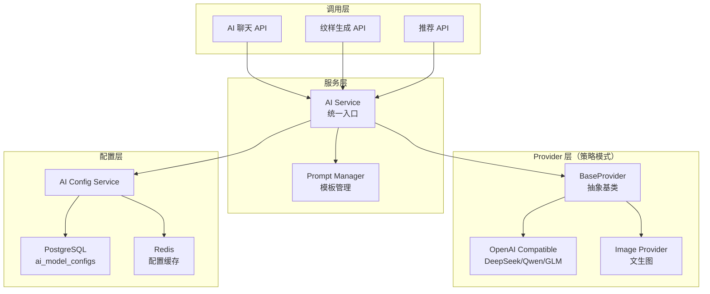

# 06 — AI 服务架构设计 | 艺育皮韵

> 多 Provider 策略模式 + 后台动态配置 + 流式响应。OpenAI 兼容协议为核心。

---

## 一、架构概览



---

## 二、Provider 策略模式

```typescript
// 抽象基类
abstract class BaseAIProvider {
  abstract chat(messages: ChatMessage[], options?: ChatOptions): AsyncGenerator<string>;
  abstract generateImage(prompt: string, options?: ImageOptions): Promise<string>;
  abstract testConnection(): Promise<boolean>;
}

// OpenAI 兼容实现（覆盖 DeepSeek / Qwen / GLM / 通义等）
class OpenAICompatProvider extends BaseAIProvider {
  constructor(private config: AIModelConfig) {}

  async *chat(messages, options) {
    const response = await fetch(`${this.config.baseUrl}/chat/completions`, {
      method: 'POST',
      headers: {
        'Authorization': `Bearer ${this.config.apiKey}`,
        'Content-Type': 'application/json',
      },
      body: JSON.stringify({
        model: this.config.modelName,
        messages,
        stream: true,
        ...this.config.extraParams,
      }),
    });
    // SSE 流式解析...
  }
}
```

---

## 三、AI 能力矩阵

| 能力 | 场景 | Provider | 默认模型 |
|------|------|----------|----------|
| **chat** | 智能问答、学习助手 | OpenAI 兼容 | DeepSeek-V3 |
| **chat** | 课程推荐、商品推荐 | OpenAI 兼容 | DeepSeek-V3 |
| **chat** | 商品描述生成 | OpenAI 兼容 | DeepSeek-V3 |
| **vision** | 作品识别、纹样分析 | OpenAI 兼容(vision) | Qwen-VL-Plus |
| **image_gen** | AI 纹样生成 | 图像生成 | FLUX / MiniMax |

---

## 四、Prompt 模板系统

```typescript
// prompts/learning-assistant.ts
export const LEARNING_ASSISTANT_PROMPT = {
  system: `你是"艺育皮韵"平台的AI学习助手，精通皮雕技艺。
你的职责：
1. 解答皮雕技法问题（选皮、画稿、镂刻、印花、染色等）
2. 推荐合适的学习路径
3. 介绍广西非遗皮雕的历史文化
4. 提供工具和材料建议

回答要求：
- 专业但通俗易懂
- 适当引用广西本地皮雕文化典故
- 对初学者友好，不使用过于专业的术语
- 回答末尾可推荐相关课程（如有）`,
  userTemplate: `{{message}}{{#if context}}\n\n当前学习上下文：{{context}}{{/if}}`,
};

// prompts/pattern-generation.ts
export const PATTERN_GENERATION_PROMPT = {
  system: `你是皮雕纹样设计专家，擅长将广西民族文化元素融入现代皮雕设计。`,
  styles: {
    zhuangjin: '壮锦风格：使用菱形/回字纹/蝴蝶纹等壮族传统纹样',
    yaozu: '瑶族风格：使用盘王纹/太阳纹等瑶族传统图腾',
    karst: '喀斯特风格：融入桂林山水/溶洞/石林等自然元素',
    modern: '现代融合：传统纹样与当代设计语言结合',
  },
};
```

---

## 五、后台配置管理

管理员可在后台动态：
- 新增/编辑/删除 AI 模型配置
- 切换各能力的激活模型
- 测试模型连通性
- 查看 AI 调用日志与统计

配置变更后 Redis 缓存自动失效，下次调用使用新配置。

---

## 六、流式响应（SSE）

```typescript
// NestJS Controller
@Post('chat')
@Sse()
async chat(@Body() dto: ChatDto): Promise<Observable<MessageEvent>> {
  return new Observable(subscriber => {
    const generator = this.aiService.chat(dto.messages);
    (async () => {
      for await (const chunk of generator) {
        subscriber.next({ data: JSON.stringify({ content: chunk, done: false }) });
      }
      subscriber.next({ data: JSON.stringify({ content: '', done: true }) });
      subscriber.complete();
    })();
  });
}
```

---

## 七、安全措施

| 措施 | 说明 |
|------|------|
| API Key 加密 | AES-256 加密存储于数据库 |
| 速率限制 | 每用户 20 次/分钟 |
| 内容审核 | AI 输出经过敏感词过滤 |
| 成本控制 | 按用户/日/月设置调用额度 |
| 日志审计 | 所有 AI 调用记录入审计日志 |
