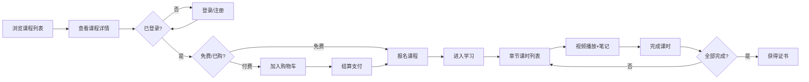
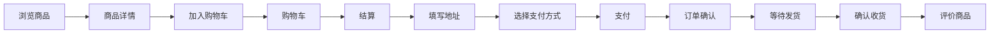

# 07 — 页面路由与导航 | 艺育皮韵

> 全站页面清单、路由规则、导航结构与用户流程图。

---

## 一、导航结构

### 主导航（Header）

```
首页 | 课程中心 | 作品画廊 | 商城 | 社区 | [搜索] | [通知] | [头像/登录]
```

### 侧边栏（Dashboard）

```
我的学习
  ├── 已报名课程
  └── 学习进度
我的创作
  ├── 我的作品
  └── 发布作品
我的订单
购物车
收藏夹
个人中心
设置
```

### 教师面板侧边栏

```
教师面板
  ├── 数据概览
  ├── 课程管理
  │   ├── 课程列表
  │   └── 创建课程
  ├── 学员管理
  └── 收入统计
```

### 管理后台侧边栏

```
管理后台
  ├── 数据仪表盘
  ├── 用户管理
  ├── 内容审核
  ├── 课程管理
  ├── 商城管理
  │   ├── 商品管理
  │   ├── 分类管理
  │   └── 订单管理
  ├── 社区管理
  ├── 财务管理
  ├── 系统配置
  │   ├── Banner 管理
  │   ├── AI 配置
  │   └── 邮件配置
  └── 审计日志
```

---

## 二、页面清单

| 路由 | 页面 | 访问权限 | 渲染方式 |
|------|------|----------|----------|
| `/` | 首页 | 公开 | SSG+ISR |
| `/courses` | 课程列表 | 公开 | SSG+ISR |
| `/courses/[slug]` | 课程详情 | 公开 | SSR |
| `/gallery` | 作品画廊 | 公开 | SSR |
| `/gallery/[id]` | 作品详情 | 公开 | SSR |
| `/shop` | 商城首页 | 公开 | SSR |
| `/shop/[slug]` | 商品详情 | 公开 | SSR |
| `/shop/categories` | 分类浏览 | 公开 | SSG |
| `/community` | 社区首页 | 公开 | SSR |
| `/community/[id]` | 帖子详情 | 公开 | SSR |
| `/heritage-map` | 非遗地图 | 公开 | CSR |
| `/login` | 登录 | 未登录 | CSR |
| `/register` | 注册 | 未登录 | CSR |
| `/forgot-password` | 忘记密码 | 未登录 | CSR |
| `/learn/[courseId]/[lessonId]` | 学习播放 | 🔒已报名 | CSR |
| `/my-courses` | 我的课程 | 🔒登录 | CSR |
| `/my-artworks` | 我的作品 | 🔒登录 | CSR |
| `/my-orders` | 我的订单 | 🔒登录 | CSR |
| `/my-orders/[id]` | 订单详情 | 🔒登录 | CSR |
| `/cart` | 购物车 | 🔒登录 | CSR |
| `/checkout` | 结算页 | 🔒登录 | CSR |
| `/profile` | 个人中心 | 🔒登录 | CSR |
| `/settings` | 设置 | 🔒登录 | CSR |
| `/create/artwork` | 发布作品 | 🔒登录 | CSR |
| `/create/pattern` | AI 纹样生成 | 🔒登录 | CSR |
| `/create/post` | 发布帖子 | 🔒登录 | CSR |
| `/notifications` | 通知中心 | 🔒登录 | CSR |
| `/teacher/dashboard` | 教师面板 | 🔒教师 | CSR |
| `/teacher/courses` | 课程管理 | 🔒教师 | CSR |
| `/teacher/courses/[id]/edit` | 编辑课程 | 🔒教师(owner) | CSR |
| `/teacher/students` | 学员管理 | 🔒教师 | CSR |
| `/admin/dashboard` | 管理仪表盘 | 🔒管理员 | CSR |
| `/admin/users` | 用户管理 | 🔒管理员 | CSR |
| `/admin/content` | 内容审核 | 🔒管理员 | CSR |
| `/admin/shop` | 商城管理 | 🔒管理员 | CSR |
| `/admin/finance` | 财务管理 | 🔒管理员 | CSR |
| `/admin/system` | 系统配置 | 🔒管理员 | CSR |
| `/admin/ai-config` | AI 配置 | 🔒管理员 | CSR |
| `/admin/*` | 其他管理页 | 🔒管理员 | CSR |

> 页面视觉设计图见 `docs/page-designs/images/`；详细路由到设计图映射见 `docs/page-designs/README.md`。

---

## 三、核心用户流程

### 3.1 学习流程



### 3.2 购物流程


