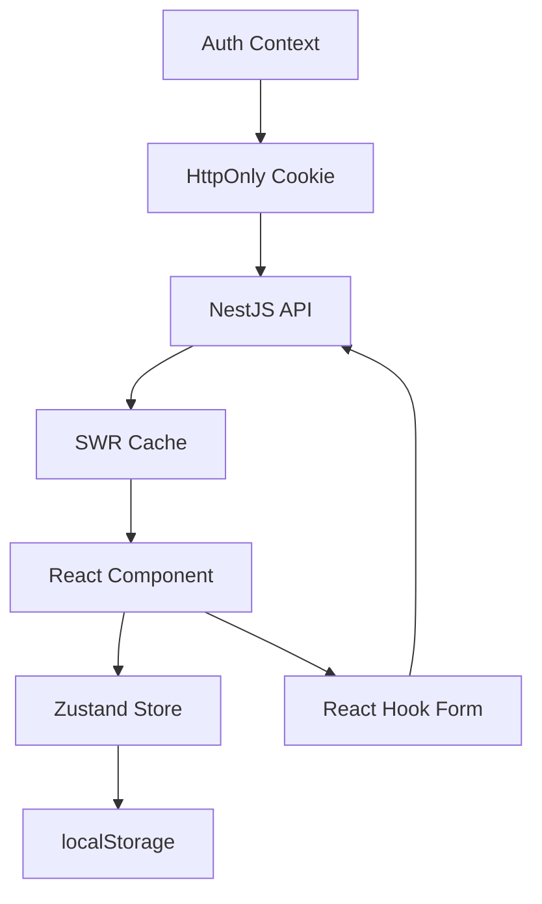

# 09 — 状态管理设计 | 艺育皮韵

> Zustand + SWR + React Context 三层状态管理方案。

---

## 一、状态分层

| 层级 | 方案 | 管理内容 |
|------|------|----------|
| **服务端数据** | SWR (stale-while-revalidate) | API 数据获取、缓存、乐观更新 |
| **全局客户端状态** | Zustand | UI 状态、购物车、主题 |
| **认证状态** | React Context | 用户信息、登录态 |
| **表单状态** | React Hook Form + Zod | 复杂表单 |
| **组件局部状态** | useState / useReducer | 简单组件状态 |

---

## 二、Zustand Stores

### useUIStore — UI 全局状态

```typescript
interface UIState {
  theme: 'light' | 'dark';
  sidebarCollapsed: boolean;
  mobileMenuOpen: boolean;
  searchOpen: boolean;

  toggleTheme: () => void;
  toggleSidebar: () => void;
  setMobileMenu: (open: boolean) => void;
  setSearchOpen: (open: boolean) => void;
}
// 持久化：theme → localStorage
```

### useCartStore — 购物车

```typescript
interface CartState {
  items: CartItem[];
  addItem: (product: IProduct, quantity: number) => void;
  removeItem: (productId: string) => void;
  updateQuantity: (productId: string, quantity: number) => void;
  clearCart: () => void;
  totalCount: () => number;
  totalAmount: () => number;
}
// 持久化：items → localStorage
// 登录后与服务端同步
```

### useNotificationStore — 通知

```typescript
interface NotificationState {
  unreadCount: number;
  notifications: INotification[];
  setUnreadCount: (count: number) => void;
  markAsRead: (id: string) => void;
  markAllRead: () => void;
}
```

---

## 三、SWR Hooks

```typescript
// 课程列表
function useCourses(query: CourseQuery) {
  return useSWR(['/courses', query], fetcher, {
    revalidateOnFocus: false,
    dedupingInterval: 30000,
  });
}

// 课程详情
function useCourse(slug: string) {
  return useSWR(slug ? `/courses/${slug}` : null, fetcher);
}

// 我的订单
function useMyOrders(page: number) {
  return useSWR(['/shop/orders', { page }], fetcher);
}

// 全局 SWR 配置
const swrConfig = {
  fetcher: async (url) => {
    const res = await apiClient.get(url);
    return res.data;
  },
  onError: (error) => {
    if (error.status === 401) { /* 重定向登录 */ }
  },
};
```

---

## 四、Auth Context

```typescript
interface AuthContextValue {
  user: IUser | null;
  isLoading: boolean;
  isAuthenticated: boolean;
  login: (email: string, password: string) => Promise<void>;
  register: (data: RegisterDto) => Promise<void>;
  logout: () => Promise<void>;
  refreshUser: () => Promise<void>;
}

// 初始化时：检查 Cookie 中的 Token → 调用 /users/me 获取用户信息
// Token 过期前自动刷新
```

---

## 五、数据流图


