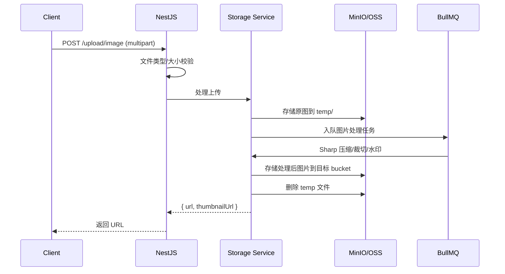

# 11 — 存储与文件管理 | 艺育皮韵

> MinIO/OSS 对象存储 + Sharp 图片处理 + FFmpeg 视频转码。

---

## 一、存储架构

| 存储类型 | 方案 | 场景 |
|----------|------|------|
| 对象存储 | MinIO（开发）/ 阿里云 OSS（生产） | 图片/视频/3D 模型/附件 |
| 数据库 | PostgreSQL JSONB | 文件元数据 |
| CDN | 阿里云 CDN / Cloudflare | 静态资源加速 |

---

## 二、Bucket 规划

| Bucket | 内容 | 访问权限 | 生命周期 |
|--------|------|----------|----------|
| `avatars` | 用户头像 | 公开读 | 永久 |
| `courses` | 课程封面/课件 | 公开读 | 永久 |
| `videos` | 课程视频 | 签名 URL | 永久 |
| `artworks` | 作品图片/3D 模型 | 公开读 | 永久 |
| `products` | 商品图片 | 公开读 | 永久 |
| `community` | 社区帖子图片 | 公开读 | 永久 |
| `patterns` | 纹样素材 | 公开读 | 永久 |
| `temp` | 临时上传 | 私有 | 24h 自动清理 |

---

## 三、图片处理（Sharp）

| 场景 | 处理 | 输出 |
|------|------|------|
| 头像 | 裁切为正方形 + 压缩 | 200×200 WebP |
| 封面图 | 等比缩放 + 压缩 | 原图 + 800×450 缩略图 |
| 商品图 | 等比缩放 + 水印 | 原图 + 400×400 缩略图 |
| 社区图 | 压缩 | 最大 1920px 宽 |
| 纹样素材 | 保持原尺寸 + 缩略图 | 原图 + 300×300 缩略图 |

---

## 四、视频处理（FFmpeg）

| 处理 | 说明 |
|------|------|
| 转码 | 统一转为 H.264 MP4 |
| 多分辨率 | 720p + 1080p（可选） |
| 封面截取 | 自动截取第 3 秒为封面 |
| 时长提取 | 提取视频时长写入数据库 |
| HLS 切片 | 长视频切片为 .m3u8 + .ts（可选） |

---

## 五、上传流程

---

## 六、安全策略

| 策略 | 说明 |
|------|------|
| 文件类型白名单 | 图片: jpg/png/webp/gif, 视频: mp4/mov |
| 文件大小限制 | 图片 ≤ 10MB, 视频 ≤ 500MB |
| 文件名重命名 | UUID + 原始扩展名，防止路径遍历 |
| 防盗链 | OSS Referer 白名单 |
| 签名 URL | 视频内容使用带过期时间的签名 URL |
| 病毒扫描 | ClamAV 扫描上传文件（可选） |
