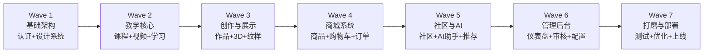

# 16 — Wave 开发路线图 | 艺育皮韵

> **方法论**：SDD（Specification-Driven Development）
> **原则**：先写规范 → 再写代码 → 规范即文档即测试依据

---

## Wave 总览

---

## 跨 Wave 页面设计与美术资源规则

所有 Wave 都必须遵循统一页面母版，先对照 `docs/17_PAGE_DESIGN_SPEC.md` 和 `docs/page-designs/README.md` 再实现前端页面。设计图位于 `docs/page-designs/images/`，其中：

| 设计板 | 适用 Wave |
|--------|-----------|
| `01-public-pages.png` | Wave 2、Wave 3、Wave 5、Wave 7 |
| `02-learner-auth-dashboard.png` | Wave 1、Wave 2、Wave 3 |
| `03-shop-order-pages.png` | Wave 4 |
| `04-community-ai-pages.png` | Wave 5 |
| `05-teacher-pages.png` | Wave 2、Wave 6 |

如果缺课程封面、作品图、商品图、头像、纹样、皮革纹理等美术资源，应优先使用 image_gen 按 `docs/page-designs/README.md` 的统一提示词生成。若 image_gen 无法使用，不得阻塞当前 Wave；按 `docs/18_ART_ASSET_BACKLOG.md` 先使用项目内占位资源继续开发，并登记缺口。

---

## Wave 1 — 基础架构 + 认证 + 设计系统

### 目标

搭建 前后端分离 项目骨架、全局设计系统、JWT 认证、基础 Layout。这是所有后续 Wave 的地基。

### 交付物

| 模块 | 交付内容 |
|------|----------|
| **前后端分离** | 前后端项目初始化，frontend + backend + shared/* |
| **数据库** | Prisma Schema 定义 + 迁移脚本 + Seed 数据 |
| **NestJS 骨架** | 项目初始化、全局 Pipes/Filters/Interceptors、Swagger 配置 |
| **认证模块** | 注册/登录/刷新/登出 API + JWT 签发 + Redis 会话 |
| **RBAC** | 角色守卫、资源所有权守卫 |
| **Next.js 骨架** | App Router 配置、根 Layout、路由组 |
| **设计系统** | CSS Variables（色彩/排版/间距/暗色模式）、基础 UI 组件 |
| **Layout** | SiteHeader + SiteSidebar + Footer + ThemeToggle |
| **页面母版** | 接入 `02-learner-auth-dashboard.png` 的认证页风格，建立统一 Header/Sidebar/Card/Button/Input |
| **占位资源** | 创建占位资源目录与基础占位图，遵循 `docs/18_ART_ASSET_BACKLOG.md` |
| **配置** | ESLint + Prettier + Husky + lint-staged + .env 模板 |
| **Docker** | docker-compose.dev.yml（PostgreSQL + Redis + MinIO） |

### 涉及文件

| 操作 | 路径 | 说明 |
|------|------|------|
| NEW | `frontend/package.json` | 前端独立依赖 |
| NEW | `backend/package.json` | 后端独立依赖 |
| NEW | `scripts/sync-shared.sh` | 共享代码同步脚本 |
| NEW | `backend/src/main.ts` | NestJS 启动文件 |
| NEW | `backend/src/modules/auth/*` | 认证模块全套 |
| NEW | `backend/src/common/*` | Guards, Filters, Pipes, Interceptors |
| NEW | `backend/prisma/schema.prisma` | 数据库 Schema |
| NEW | `frontend/src/app/globals.css` | 设计系统 CSS |
| NEW | `frontend/src/app/layout.tsx` | 根 Layout |
| NEW | `frontend/src/app/(auth)/*` | 登录/注册页 |
| NEW | `frontend/src/components/ui/*` | Button, Card, Input, Modal, Toast 等 |
| NEW | `frontend/src/components/layout/*` | Header, Sidebar, Footer |
| NEW | `frontend/src/contexts/AuthContext.tsx` | 认证上下文 |
| NEW | `frontend/src/stores/ui-store.ts` | Zustand UI Store |
| NEW | `shared/types/src/index.ts` | 共享类型 |
| NEW | `shared/validators/src/index.ts` | Zod Schema |
| NEW | `infra/docker-compose.dev.yml` | 开发环境 |
| NEW | `.env.example` | 环境变量模板 |
| NEW | `AGENTS.md` | AI 开发规范 |

### 验收标准

- [ ] `cd frontend && npm run dev` 启动前端 + `cd backend && npm run start:dev` 启动后端
- [ ] PostgreSQL + Redis + MinIO 容器正常运行
- [ ] 注册 → 登录 → 刷新 → 登出流程完整
- [ ] 未登录访问受保护路由自动跳转 /login
- [ ] 暗色/亮色模式切换正常
- [ ] 响应式布局适配手机/平板/桌面
- [ ] 登录/注册/忘记密码页面与页面设计母版保持统一
- [ ] image_gen 不可用时有占位资源和缺口记录，不阻塞开发
- [ ] Swagger 文档在 /api/docs 可访问
- [ ] 基础 UI 组件渲染正常

---

## Wave 2 — 教学核心

### 目标

实现课程管理 CRUD、视频上传与播放、学习进度跟踪、搜索功能。

### 交付物

| 模块 | 交付内容 |
|------|----------|
| **课程模块（后端）** | 课程/章节/课时 CRUD、报名、进度 API |
| **文件上传** | MinIO 集成、图片处理(Sharp)、视频上传 |
| **搜索** | Meilisearch 集成、课程索引同步 |
| **课程列表页** | 筛选/排序/搜索、CourseCard 组件 |
| **课程详情页** | SSR 渲染、章节大纲、教师信息、评价 |
| **学习播放页** | 视频播放器、进度记录、章节导航 |
| **教师面板** | 创建/编辑课程、章节管理、学员列表 |
| **设计对齐** | 对照 `01-public-pages.png`、`02-learner-auth-dashboard.png`、`05-teacher-pages.png` 实现页面 |
| **课程素材** | 缺课程封面/教师头像时按 image_gen 模板生成，失败则登记到 `18_ART_ASSET_BACKLOG.md` |

### 验收标准

- [x] 教师可创建/编辑/发布课程
- [x] 视频上传+处理正常（MinIO + StorageService）
- [x] 课程列表搜索/筛选正常
- [x] 学员报名→观看→进度记录完整
- [x] 课程详情 SEO 友好（SSR）
- [x] 课程与教师页面视觉风格与页面母版一致
- [x] 课程封面、头像等资源已生成或登记占位缺口

---

## Wave 3 — 创作与展示

### 目标

实现作品管理、画廊展示、3D 模型查看、纹样素材库。

### 交付物

| 模块 | 交付内容 |
|------|----------|
| **作品模块（后端）** | 作品 CRUD、多图上传、点赞/收藏 API |
| **作品画廊页** | 瀑布流展示、筛选、无限滚动 |
| **作品详情页** | 多图查看、创作故事、评论区 |
| **3D 展示** | Three.js/R3F 加载 glTF 模型 |
| **纹样素材库** | 壮锦/瑶族/现代纹样展示与下载 |
| **发布作品页** | 多图上传、技法/材料标签、创作故事编辑 |
| **设计对齐** | 对照 `01-public-pages.png`、`02-learner-auth-dashboard.png`、`04-community-ai-pages.png` 实现画廊/发布/纹样页面 |
| **作品素材** | 缺作品图、纹样图、3D 预览图时按 image_gen 模板生成，失败则登记到 `18_ART_ASSET_BACKLOG.md` |

### 验收标准

- [x] 作品发布+多图上传正常
- [x] 画廊瀑布流+无限滚动正常
- [ ] 3D 模型交互（旋转/缩放）正常（需要安装 @react-three/fiber + @react-three/drei）
- [x] 纹样素材浏览与下载正常
- [x] 点赞/收藏计数正确
- [x] 画廊、作品详情、发布作品页面视觉风格统一
- [x] 作品、纹样、皮革纹理资源已生成或登记占位缺口

---

## Wave 4 — 商城系统

### 目标

完整电商闭环：商品管理、购物车、订单、支付（Mock）、评价。

### 交付物

| 模块 | 交付内容 |
|------|----------|
| **商品模块** | 商品/分类 CRUD、多图、属性管理 |
| **购物车** | 添加/删除/修改数量、Zustand + API 同步 |
| **订单模块** | 下单 → 支付(Mock) → 发货 → 确认收货 |
| **商城首页** | 分类导航、Banner、推荐、商品列表 |
| **商品详情页** | 多图轮播、规格选择、评价 |
| **结算页** | 地址管理、订单确认 |
| **订单列表页** | 状态筛选、订单详情 |
| **商家面板** | 商品管理、订单处理、收入统计 |
| **设计对齐** | 对照 `03-shop-order-pages.png` 实现商城、电商流程和订单页面 |
| **商品素材** | 缺商品图、商家头像、Banner 时按 image_gen 模板生成，失败则登记到 `18_ART_ASSET_BACKLOG.md` |

### 验收标准

- [x] 商品 CRUD + 多图上传正常
- [x] 购物车增删改查正常
- [x] 下单 → 支付 → 发货 → 收货完整流程
- [x] 库存扣减正确（乐观锁 version 字段）
- [x] 广西特色商品标识显示
- [x] 商品评价功能正常
- [x] 商城、购物车、结算和订单页面视觉风格统一
- [x] 商品图、Banner、商家头像已生成或登记占位缺口

---

## Wave 5 — 社区与 AI

### 目标

社区互动功能 + AI 智能服务（问答、纹样生成、推荐）。

### 交付物

| 模块 | 交付内容 |
|------|----------|
| **社区模块（后端）** | 帖子 CRUD、评论、点赞 API |
| **AI 模块（后端）** | OpenAI 兼容 Provider、Prompt 模板、流式响应 |
| **社区首页** | 话题广场、帖子列表、筛选 |
| **帖子详情** | 内容展示、评论区、点赞 |
| **发帖页** | 富文本编辑、图片上传、标签选择 |
| **AI 问答** | 悬浮 AI 助手、流式对话、学习上下文 |
| **AI 纹样生成** | 输入描述 → 生成纹样参考图 |
| **推荐系统** | AI 驱动的课程/商品推荐 |
| **通知系统** | WebSocket 实时通知、通知列表 |
| **设计对齐** | 对照 `04-community-ai-pages.png` 实现社区、AI、通知、纹样生成页面 |
| **AI/社区素材** | 缺帖子图、纹样生成示例、用户头像时按 image_gen 模板生成，失败则登记到 `18_ART_ASSET_BACKLOG.md` |

### 验收标准

- [ ] 社区发帖/评论/点赞正常
- [ ] AI 对话流式响应正常
- [ ] AI 纹样生成功能可用
- [ ] 后台可配置切换 AI 模型
- [ ] 通知实时推送正常
- [ ] 社区、AI 助手、通知页面视觉风格统一
- [ ] AI 纹样生成的图片落库/入库策略与占位策略清晰

---

## Wave 6 — 管理后台

### 目标

完整管理后台：数据仪表盘、用户管理、内容审核、财务、系统配置。

### 交付物

| 模块 | 交付内容 |
|------|----------|
| **仪表盘** | 用户/课程/订单/收入统计图表 |
| **用户管理** | 列表、搜索、角色变更、封禁 |
| **内容审核** | 课程/作品/帖子审核队列 |
| **商城管理** | 商品审核、分类管理、订单管理 |
| **财务管理** | 收入统计、商家结算 |
| **Banner 管理** | 首页/商城 Banner CRUD |
| **AI 配置** | 模型新增/编辑/切换/测试 |
| **邮件配置** | SMTP 配置、模板管理 |
| **审计日志** | 关键操作日志查询 |
| **设计对齐** | 对照 `05-teacher-pages.png` 延展管理后台，高信息密度但保留统一皮革暖色母版 |
| **后台素材** | 缺 Banner、审核预览图、配置页示例图时按 image_gen 模板生成，失败则登记到 `18_ART_ASSET_BACKLOG.md` |

### 验收标准

- [ ] 仪表盘数据图表正确显示
- [ ] 用户角色变更/封禁生效
- [ ] 内容审核通过/驳回流程正常
- [ ] Banner 管理正常
- [ ] AI 模型配置切换生效
- [ ] 审计日志记录完整
- [ ] 管理后台与教师后台共享侧栏、表格、卡片和图表风格
- [ ] 后台 Banner/审核预览等资源已生成或登记占位缺口

---

## Wave 7 — 打磨与部署

### 目标

性能优化、E2E 测试、生产部署、文档完善。

### 交付物

| 模块 | 交付内容 |
|------|----------|
| **性能优化** | 图片懒加载、代码分割、SSR 优化、数据库查询优化 |
| **E2E 测试** | Playwright 核心流程测试 |
| **SEO** | Meta Tags、OG 标签、Sitemap、Robots |
| **PWA** | Service Worker、离线缓存（可选） |
| **Docker 生产配置** | 多阶段构建、Nginx 配置、SSL |
| **CI/CD** | GitHub Actions 完整流水线 |
| **文档** | README、API 文档、部署手册 |
| **动画打磨** | 页面过渡、微交互、骨架屏 |
| **视觉验收** | 全站对照 `docs/page-designs/images/` 做一致性检查，补齐移动端、空状态、错误状态 |
| **资源收口** | 清理占位资源，按 `docs/18_ART_ASSET_BACKLOG.md` 完成或保留明确待办 |

### 验收标准

- [ ] Lighthouse 评分 ≥ 80（Performance + Accessibility + SEO）
- [ ] 核心 E2E 测试全部通过
- [ ] Docker Compose 一键部署成功
- [ ] 无 P0/P1 级 Bug
- [ ] README 和文档完善
- [ ] 所有页面对照设计图完成视觉一致性检查
- [ ] 美术资源缺口已清零或明确记录为上线前待办

---

## 跨 Wave 约束

| 约束 | 说明 |
|------|------|
| **SDD 规范** | 每个 Wave 开始前对照规范文档，新增接口先更新 API 规格 |
| **向后兼容** | 共享类型(shared-types)变更不破坏已有代码 |
| **渐进式交付** | 每个 Wave 完成后可独立部署和演示 |
| **AI 辅助** | 开发过程中鼓励使用 AI 辅助编码、测试生成、文案撰写 |
| **页面设计** | 所有前端页面对照 `docs/17_PAGE_DESIGN_SPEC.md` 与 `docs/page-designs/README.md` |
| **素材缺口** | image_gen 可用时生成素材；不可用时按 `docs/18_ART_ASSET_BACKLOG.md` 占位并登记 |
| **代码审查** | 每个 Wave 完成后自查编码规范 Checklist |
